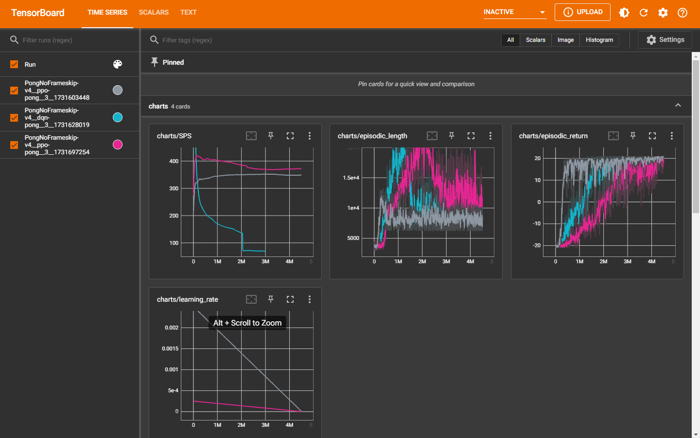
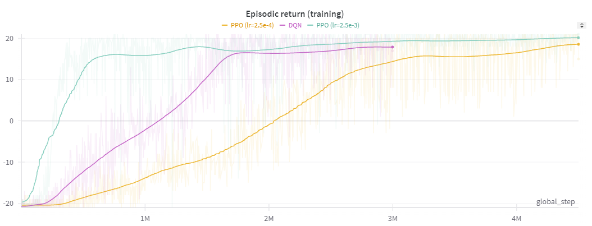

# RL Lab

This repository contains reinforcement learning experiments implemented as part of a graduate-level course in Reinforcement Learning.

## Setup Instructions

### Environment Setup
```bash
# Create conda environment
conda create -n rl-lab python=3.10
conda activate rl-lab

# Install dependencies
pip install -r requirements.txt
```


### Running TensorBoard
To visualize training metrics:
```bash
tensorboard --logdir runs
```

Then open http://localhost:6006 in your browser.



## Project Structure
```
├── docs/ # Documentation and supplementary materials
│ ├── dqn/ # DQN algorithm materials
│ └── ppo/ # PPO algorithm materials
├── src/ # Source code
│ ├── dqn-pong.py # DQN implementation for Pong
│ └── ppo-pong.py # PPO implementation for Pong
├── videos/ # Training and evaluation videos
├── runs/ # Training tensorboard logs and saved models
└── requirements.txt # Python dependencies
```


## Experiments

### Atari Pong

[📊📃Experiment Report on W&B](https://wandb.ai/hamzalab/rl-lab/reports/Playing-Atari-Pong-with-DQN-and-PPO--VmlldzoxMDE5MTA0MQ) 



| Algorithm | Run ID| Code | Demo | W&B | Docs | Run Command | Trained PyTorch Model |
|------------|------|------|------|-----|---------------|-------------|---------------------|
| DQN | `PongNoFrameskip-v4__dqn-pong__3__1731628019` | [dqn-pong.py](src/dqn-pong.py) | [Video](videos/PongNoFrameskip-v4__dqn-pong__3__1731628019-eval/rl-video-episode-1.mp4) | [W&B Run](https://wandb.ai/hamzalab/rl-lab/runs/2tdlvw0m) | [Q-Network Architecture](docs/dqn/dqn-diagram.mermaid) | `python src\dqn-pong.py --seed 3 --total_timesteps 3000000 --buffer_size 500000 --capture_video --track --wandb_project_name rl-lab --wandb_entity YOUR_WANDB_ENTITY` | [Q-Network](runs/PongNoFrameskip-v4__dqn-pong__3__1731628019/dqn-pong.final_model) |
| PPO w/ Clip (lr=2.5e-3) | `PongNoFrameskip-v4__ppo-pong__3__1731603448` | [ppo-pong.py](src/ppo-pong.py) | [Video](videos/PongNoFrameskip-v4__ppo-pong__3__1731603448-eval/rl-video-episode-8.mp4) | [W&B Run](https://wandb.ai/hamzalab/rl-lab/runs/hqy93jln) | [PPO Clip Pseudocode](docs/ppo/ppo-clip-algorithm.pdf) - [Agent Neural Net](docs/ppo/ppo-agent-2-heads-net.mermaid) | `python src/ppo-pong.py --seed 3 --capture_video --total_timesteps 4500000 --checkpoint_freq 1000 --learning_rate 2.5e-3 --track --wandb_project_name rl-lab --wandb_entity YOUR_WANDB_ENTITY` | [Policy](runs/PongNoFrameskip-v4__ppo-pong__3__1731603448/ppo-pong.final_model) |
| PPO w/ Clip (lr=2.5e-4)| `PongNoFrameskip-v4__ppo-pong__3__1731697254` | [ppo-pong.py](src/ppo-pong.py) | [Video](videos/PongNoFrameskip-v4__ppo-pong__3__1731697254-eval/rl-video-episode-8.mp4) | [W&B Run](https://wandb.ai/hamzalab/rl-lab/runs/0zr7y2p5) | [PPO Clip Pseudocode](docs/ppo/ppo-clip-algorithm.pdf) - [Agent Neural Net](docs/ppo/ppo-agent-2-heads-net.mermaid) | `python src/ppo-pong.py --seed 3 --capture_video --total_timesteps 4500000 --checkpoint_freq 1000 --learning_rate 2.5e-4 --track --wandb_project_name rl-lab --wandb_entity YOUR_WANDB_ENTITY` | [Policy](runs/PongNoFrameskip-v4__ppo-pong__3__1731697254/ppo-pong.final_model) |


# Credits
- Codes are based on [CleanRL](https://docs.cleanrl.dev/) implementations.
